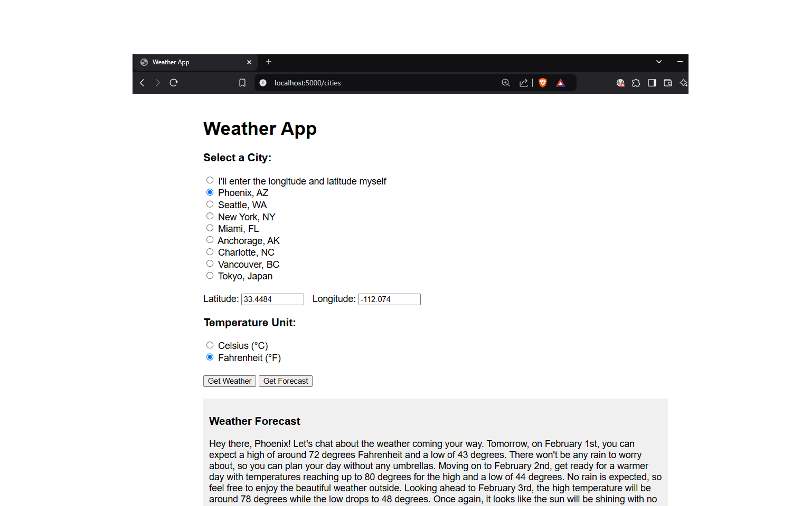
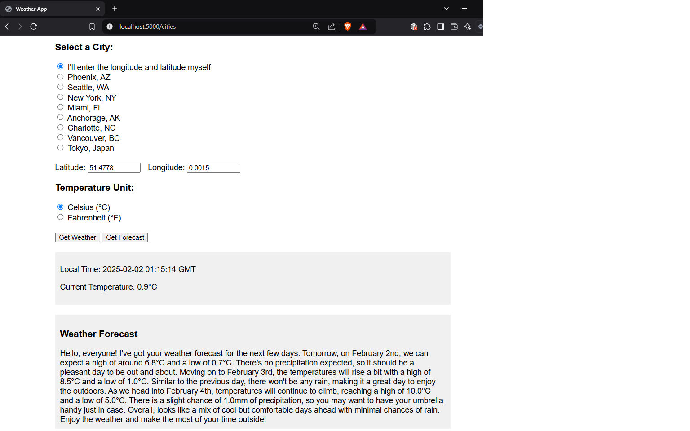

# Weather API

Dockerized weather API in Python

## Overview

Dockerized weather API wrapper for open-meteo.com built with Python and Flask.

## Features

- Real-time weather data from open-meteo.com
- Current temperature at 2m above ground
- Local time display for each location
- Supports both Celsius and Fahrenheit
- Pre-configured cities:
  - Phoenix, AZ (default)
  - Charlotte, NC
  - Vancouver, BC
  - Tokyo, Japan
- 
You can also specify your own location by entering the latitude and longitude. For the Greenwich observatory, use:
- Latitude: 51.4778
- Longitude: 0.0015

## Quick Start
You can access the weather service through three different interfaces:

### 1. Web Interface
The web interface is available at `http://localhost:5000/cities` when running the container. It provides a user-friendly way to select cities or enter custom coordinates.

### 2. REST API Endpoint
Access weather data directly via HTTP GET requests:
```json
GET http://localhost:5000/weather?lat=33.4484&lon=-112.0740&unit=fahrenheit

Response:
{
  "local_time": "2025-01-30 18:09:48",
  "temperature": 52.9,
  "unit": "°F"
}
```

### 3. Swagger UI
Interactive API documentation is available at http://localhost:5000/api/. 

This interface allows you to:

- Explore available endpoints
- Test API calls directly from the browser
- View request/response schemas
- Try out different parameters

## Weather Forecast Feature
The application includes an AI-powered forecast feature that provides natural language weather predictions:

1. Click the "Get Forecast" button to receive a friendly, conversational 3-day forecast
2. The forecast is generated using OpenAI's GPT-3.5-turbo model, transforming raw weather data into an engaging narrative
3. The forecast includes:
   - Temperature highs and lows
   - Precipitation predictions
   - Weather conditions
   - Location-specific details when available

Example forecast:

_Good morning! Looking at the weather for Phoenix, AZ, you can expect a warm and sunny day ahead. 
Today's high will reach 85°F with a low of 65°F. There's only a 5% chance of precipitation, 
making it perfect for outdoor activities. The next couple of days will remain consistently pleasant..._

Note: This feature requires an OpenAI API key configured in the environment variables.

### Screen shots of the forecast feature
You can see the forecast feature from the web interface. Start at `http://localhost:5000/cities`.

Here is a screenshot of the forecast feature for the default location: Phoenix, AZ.


Here is a screenshot of the forecast feature Greenwich, England. Note that the forecast does not mention the city name,
as the user entered by latitude and longitude.



# Build the Docker container:
```bash
docker build -t weather-app .
```
## Features

- Retrieve current weather data for a given location
- Support for multiple weather data providers
- Caching mechanism for improved performance
- RESTful API design

## Setup Instructions

1. Clone the repository:
 ```bash  
   git clone https://github.com/sourcegraph/weather-api.git
   cd weather-api
```

2. Build the Docker image:
   
   docker build -t weather-api .

3. Run the container:
   
   docker run -p 5000:5000 weather-app

## API Documentation

The API will be available at `http://localhost:5000/weather`.

### Get Current Weather

Endpoint: `/weather`

Method: `GET`

Query Parameters:
- lat: Latitude of the location (required)
- lon: Longitude of the location (required)
- unit: Unit of measurement (optional, default is celsius)

Example Request:

GET /weather?lat=33.4484&lon=-112.0740&unit=fahrenheit


Example Response:

{
  "location": "London",
  "temperature": 15.5,
  "humidity": 76,
  "wind_speed": 3.6,
  "description": "Partly cloudy"
}

## Next Steps

- Add support for more cities worldwide
- Implement weather alerts and notifications
- Add historical weather data visualization
- Include wind speed and humidity metrics
- Enable user location detection
- Add multi-language support

## Limitations

- I've hard-coded the API key for OpenAI. In a real-world scenario, this would be stored securely in environment variables. I will remove it by about 2/5/2025. After then, the weather forecasts will have "Undefined."
- It's not a production-ready application, and does not have a lot of security features, such as rate limiting or authentication.
- Also, the error handling is not robust.

## Contributing

Contributions are welcome! Please read the [CONTRIBUTING.md](CONTRIBUTING.md) file for details on our code of conduct and the process for submitting pull requests.

## License

This project is licensed under the MIT License - see the [LICENSE](LICENSE) file for details.


